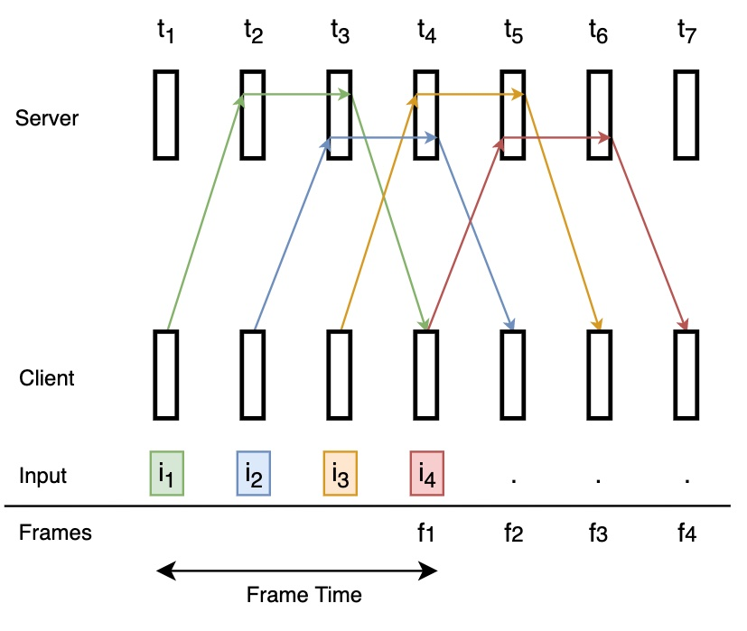

# FrameReject
FrameReject is a probabilistic state prediction method to determine the probability of future frames, and reject frames with low probability. FrameReject is used in cloud gaming to minimize the number of frames that needs to be sent.

FrameReject is created as a project for NUS Computing CS5340 Course, 2nd Term of 2022.

We have developed FrameReject specifically for the game "Breakout". We do not provide the rom files in this repo.

## Quick Start
### Requirements
- pygame `pip install pygame`
- ale_py `pip install ale_py`
- pgmpy `pip install pgmpy`

### Collect Live Game Data
Use the below commands to collect live gaming input and game states data into the `_data` folder
```
local_game_client.py --collect_data --cont_input
```
## Model Training and Testing
See: [model.ipynb](model.ipynb)

After collecting the train/test data, change the variables `train_filenames` and `test_filenames` to consist of the generated train/test data files.

## Game Clients
### Local Game Client
The local game client uses Arcade Learning Environment and Pygame to run the game loop directly on our machine.

##### Using the Local Game Client
Example Local Game Client Command, to toggle data collection and continuous input.
```
local_game_client.py --collect_data --cont_input
```
Other flags include:
- `num_ep` to determine the number of episodes before the game runtime ends.
- `rand_input` to randomize inputs, so the game runs without the players having to play.

### Networked Game Client/Server
#### How it Works


The Networked Game Client/Server interaction is implemented as above. Client will read user input at every timestep, and consequently send the inputs along with the request for frames to the Server. Once Server sends the frames and Client receives it, showing the frames to the player will be done at the nearest timestep from when the frames arrive.

#### Using the Networked Game Client/Server Locally
Example Server Command (Run this first)
```
python3 base_game_server.py --server_address 'localhost' --main_port 10500 --input_port 10501
```

Example Client Command
```
python3 base_game_client.py --server_address 'localhost' --main_port 10500 --input_port 10501
```

You can also do profiling by adding the `--profiling` flag on either client or server. Note that in server profiling, inputs will be randomized instead of manually inputted from the player.

Note: For MacOS, you need to use `0.0.0.0` as the `server_address`, instead of `localhost`.

## Credits

Main Contributors:
- Lakshmi Sai Priyanka Boddapati
- Muhammad Aldo Aditiya Nugroho
- Saurabh Singh
- Vaibhav Dasarahalli Ashoka
- Varun Venkatesh Narayanan

Thank you to Prof. Harold Soh Soon Song and Teaching Assistants Chen Kaiqi and Bi Jianxin of NUS Computing for assisting and teaching us through CS5340, in the 2nd Term of 2022.
