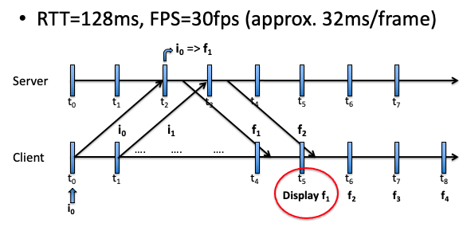

# FrameReject
CS5340 2022 Project.

## Game Client/Server
### How it Works


The Game Client/Server interaction is implemented as above. Client will receive user input at every timestep, and consequently send the request for frames to the Server. Once Server sends the frames and Client receives it, showing the frames to the player will be done at the nearest timestep from when the frames arrive.

### Requirements
- pygame `pip install pygame`
- ale_py `pip install ale_py`

### Using the Game Client/Server Locally
Example Server Command (Run this first)
```
python3 base_game_server.py --main_port 10500 --input_port 10501
```

Example Client Command
```
python3 base_game_client.py --server_address '0.0.0.0' --main_port 10500 --input_port 10501 --frame_delay_ms 0
```

You can also do profiling by adding the `--profiling` flag on either client or server. Note that in server profiling, inputs will be randomized instead of manually inputted from the player.
